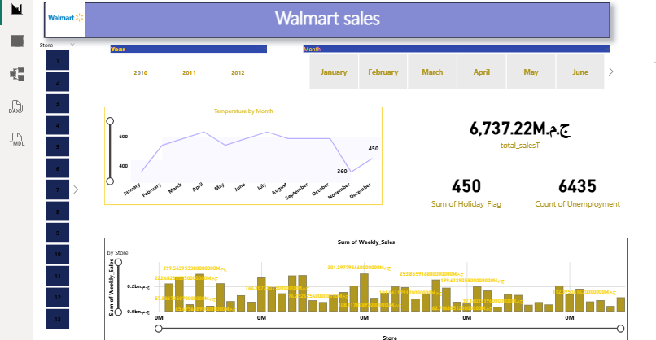

# Walmart-Sales-Forecasting-Insights
🛒 تحليل مبيعات وال مارت وعوامل التأثير الاقتصادي | Walmart Sales &amp; Economic Analysis
مشروع تحليل بيانات شامل يهدف إلى دراسة أداء مبيعات شركة Walmart وربطها بالمتغيرات الخارجية مثل درجات الحرارة، العطلات الرسمية، ومعدلات البطالة باستخدام Power BI.
📝 وصف المشروع (Project Overview)
يركز هذا التقرير على تقديم رؤى متعمقة حول كيفية تأثر المبيعات الأسبوعية بالعوامل الموسمية والاقتصادية. تم تحليل البيانات لفترة زمنية تمتد بين عامي 2010 و2012 عبر فروع مختلفة (Stores).
🛠️ المميزات والتحليلات (Key Features)
مؤشرات الأداء (KPIs):
إجمالي المبيعات (6.7 مليار ج.م).
تأثير العطلات الرسمية (Holiday Flag).
مؤشر معدلات البطالة (Count of Unemployment).
التحليل البيئي: مخطط يوضح تغير درجات الحرارة شهرياً ودراسة علاقتها بنمط الشراء.
توزيع المبيعات: رسم بياني يوضح "مجموع المبيعات الأسبوعية" لكل متجر (Store) على حدة، مما يساعد في مقارنة أداء الفروع.
الفلترة الذكية (Slicers): إمكانية تصفية البيانات حسب "رقم المتجر"، "السنة"، و "الشهر" للوصول لنتائج دقيقة.
🧰 الأدوات والتقنيات (Tools Used)
Business Intelligence Tool: Power BI.
Data Modeling: ربط بيانات المبيعات بالجداول الزمنية والبيانات الاقتصادية.
Advanced Analytics: استخدام لغة DAX لحساب إجمالي المبيعات (Total Sales) والمؤشرات التجميعية.
📈 الأهداف من المشروع (Objectives)
فهم تأثير المواسم والأعياد على زيادة أو نقصان المبيعات.
تحديد المتاجر ذات الأداء الأعلى والأقل لتقديم توصيات إدارية.
تحليل مدى تأثير الحالة الاقتصادية (البطالة) على القوة الشرائية للمستهلكين.

